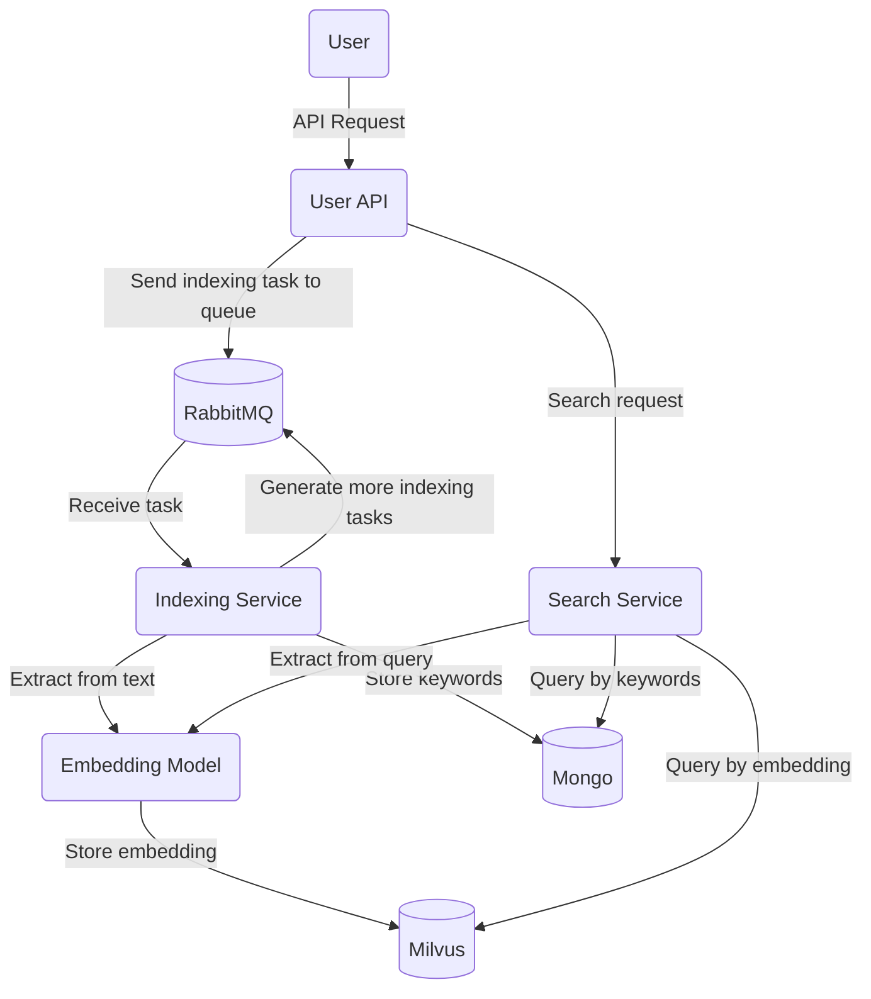

# Semantic search engine

Semantic search engine written in Java as a university project

> [!WARNING]  
> This project is **absolutely not production ready**. It was developed as a university project, as a proof of concept. If you see this message, it means that I am already developing a new version of this project, which is based on a microservice architecture, and is much more optimized.

## How to run

1. You need to define some env vars:  
   ```bash
   export MILVUS_HOST=localhost MILVUS_PORT=19530 MONGODB_URI=mongodb://localhost:27017/ RABBITMQ_HOST=localhost RABBITMQ_USERNAME=user RABBITMQ_PASSWORD=pass MODEL_PATH=models/model.onnx
   ```

2. You need an embedding model in ONNX format. I used this model: [cointegrated/LaBSE-en-ru](https://huggingface.co/cointegrated/LaBSE-en-ru). To convert, I used the utility from this article: [Export to ONNX](https://huggingface.co/docs/transformers/serialization). Also, you can use any embedding model in ONNX format with a vector dimension of 768. Put the model in a models folder, like `models/model.onnx`

3. Build and run the project with:
   ```bash
   ./gradlew run
   ```

4. The API will be available on port 4567

> [!NOTE]  
> The project was written with an emphasis on the fact that it will be possible to run as many indexing workers as you want. But, due to the tight deadlines, there was not enough time for optimization, and each indexing worker loads a model into its memory. Run with caution!

## ~~Shitty~~ project architecture


